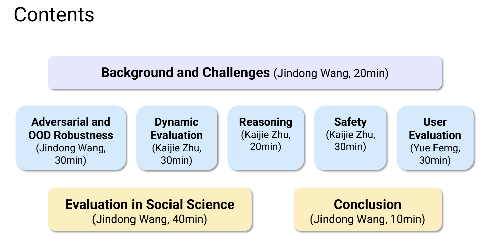

# Evaluating Large Language Models: Challenges and Methods

- Room 119B, Philadelphia Convention Center, PA, USA
- 2-6pm, February 25, 2025

## Presenters

- [Jindong Wang](https://jd92.wang/), William & Mary, jwang80 (at) wm.edu
- [Kaijie Zhu](https://immortalise.github.io/), UC Santa Barbra, kaijiezhu (at) ucsb.edu
- [Linyi Yang](https://yanglinyi.github.io/), Westlake University, yanglinyi (at) westlake.edu.cn
- [Yue Feng](https://fengyue-leah.github.io/), University of Birmingham, yueyuef (at) outlook.com
- [Yue Zhang](https://frcchang.github.io/), Westlake University, zhangyue (at) westlake.edu.cn

## Contents at a glance

Slides available to download: [Google Drive](https://drive.google.com/file/d/1YnXQ0Xtb--nkGvcLB5XV-ZYkD_sO4QQy/view?usp=sharing)

- Background and challenges
- Evaluation approaches
  - Adversarial and OOD robustness
  - Dynamic evaluation
  - Reasoning
  - Safety
  - User evaluation
- Evaluation in social science
- Conclusion

## Acknowledgement

<!--  -->
